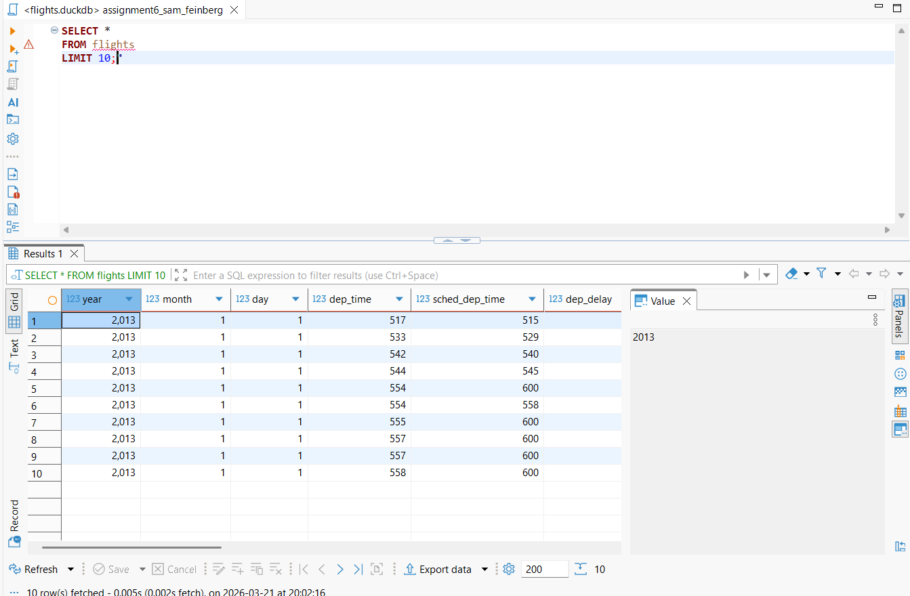
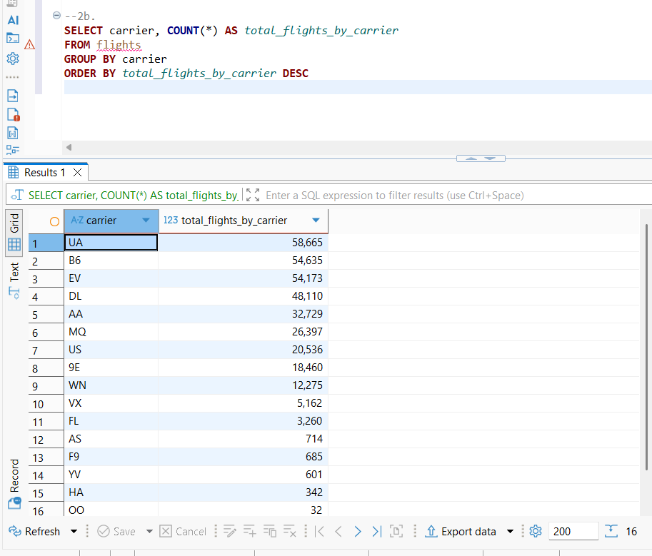
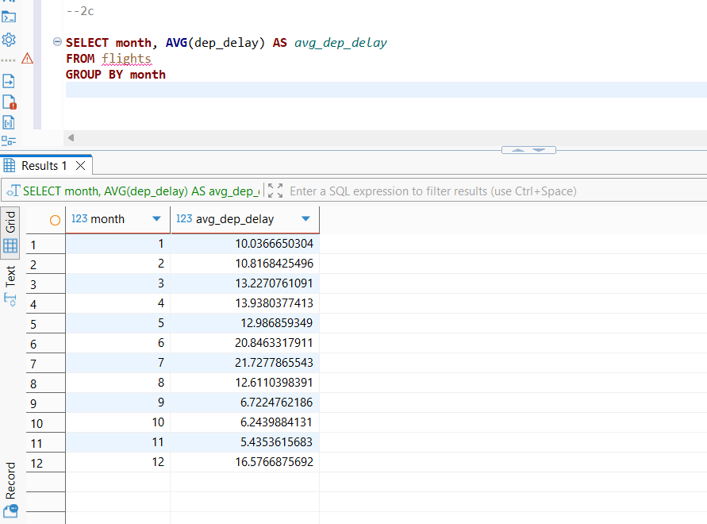
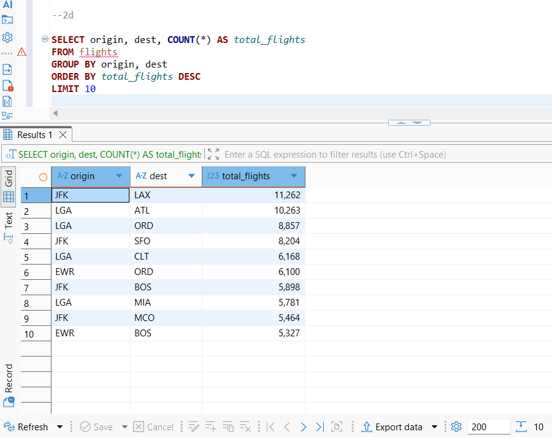

```{r}
#| label: Set-up

setwd("C:/Users/samgf/Desktop/assignment-6-samfeinberg")
getwd()

library(tidyverse)
library(DBI)
library(dbplyr)
library(duckdb)
library(nycflights13)

```

## **Part I**

### a.

```{r}
#| label: Part 1a

conn <- dbConnect(duckdb(), "../assignment-6-samfeinberg/data/flights.duckdb", read_only = TRUE)

dbIsValid(conn)
dbListTables(conn)
dbListFields(conn, "flights")

dbGetQuery(conn, "SELECT *
            FROM flights
            LIMIT 10;")

# Here, I first connected with the database on duckdb using dbConnect(). I then checked the connection, and ran some tests to see the data. Then, I used dbGetQuery, and wrote an SQL query to see the first 10 rows from the flights table.
```

### b.

```{r}
#| label: Part 1b

# i.

dbGetQuery(conn, "SELECT COUNT(*) AS total_flights
            FROM flights")

# ii.

dbGetQuery(conn, "SELECT carrier, COUNT(*) AS total_flights_by_carrier
            FROM flights
            GROUP BY carrier")

# In this part, I first did a query to select the total amount of flights, by counting the total rows in the flights table. Then, I made a query to count the total flights for each carrier, by using GROUP BY to seperate the table by the carrier.

```

### c.

```{r}
#| label: Part 1c

dbGetQuery(conn, "SELECT AVG (dep_delay) AS avg_dep_delay,
            FROM flights")

# Here, I made a query to take the average of dep_delay and return that value.

```

### d. 

```{r}
#| label: Part 1d

dbGetQuery(conn, "SELECT dest, COUNT(*) AS total_flights,
           FROM flights
           GROUP BY dest
           ORDER BY total_flights DESC
           LIMIT 5")

# In this part, my query selected destination and a new variable called total flights. I used GROUP BY to count total flights at each destination, and ORDER BY to sort the flights at each destination in descending order. I lastly used LIMIT to only see the top 5 destinations for total flights.

```

### e.

```{r}
#| label: Part 1e

avg_delay_by_carrier <- dbGetQuery(conn, "SELECT carrier, 
                                   AVG(arr_delay) AS avg_arr_delay,
                                   FROM flights,
                                   GROUP BY carrier
                                   ORDER BY avg_arr_delay DESC")
avg_delay_by_carrier

dbDisconnect(conn)
dbIsValid(conn)

# In this part, I used a SQL query to find the average arrival delay for each carrier, and sort that from greatest to least. I saved the table in my environment as avg_delay_by_carrier. Finally, I ended the connection and checked that it was no longer valid.

```

## **Part II**

### a. 

{width="617"}

In this part, I ran an SQL query in DuckDB to show the first 10 lines of the flights dataset.

### b.

{width="580"}

In this part, I used this query to count total flights for each carrier, and used ODER BY total_flights_by_carrier DESC to sort the table in descending order.

### c.

{width="597"}

Here, I created the column avg_dep_delay, and calculated it when grouping by month.

### d.

{width="563"}

Here, I used "GROUP BY origin, dest" to group the data into all the routes taken by flights in the dataset. I found the total number flights that took each route, and sorted the top 10 in descending order.

### e.

In this part, I exported the table from part 2b as a CSV. It is in the GitHub repository.
